# 🎮 JEC Esports – Full Stack Tournament Management Platform

<div align="center">


</div>

---

## 🚀 Overview

**JEC Esports** is a production-ready full-stack esports tournament management platform designed to simplify the complete tournament lifecycle for players and administrators.

Instead of managing registrations, payments, wallets, tournaments, and user verification across multiple tools, the platform centralizes everything into a single web application.

The project provides secure authentication, virtual wallet management, tournament registration, transaction tracking, role-based administration, and a scalable backend powered by **Supabase** and **PostgreSQL**.

---

# 🎯 Problem Statement

Many community esports tournaments are still managed using multiple disconnected platforms such as:

- Google Forms for registration
- WhatsApp & Discord for communication
- Excel sheets for player management
- UPI screenshots for payment verification
- Manual prize distribution

This workflow becomes difficult to manage as the number of tournaments and participants increases.

Some common problems include:

- Manual registration verification
- Payment fraud possibilities
- Time-consuming wallet management
- No centralized tournament control
- Poor transaction tracking
- Lack of role-based administration
- Difficulty scaling operations

---

# 💡 Solution

JEC Esports solves these challenges by providing a centralized tournament management platform where users can:

- Register and authenticate securely
- Participate in esports tournaments
- Manage a virtual coin wallet
- Deposit and withdraw funds
- Track complete transaction history
- Receive tournament rewards
- Access personalized dashboards
- Allow administrators to manage the complete platform through a dedicated Admin Panel

The application reduces manual work, improves transparency, and provides a scalable architecture suitable for gaming communities.

---

# ✨ Key Features

### 👤 User Features

- Secure Registration & Login
- Profile Management
- Tournament Participation
- Coin Wallet System
- Deposit Coins
- Withdraw Coins
- Transaction History
- Reward Tracking
- Responsive Dashboard

---

### 👨‍💼 Admin Features

- Tournament Management
- User Management
- Wallet Monitoring
- Deposit Verification
- Withdrawal Approval
- Transaction Monitoring
- Role-Based Access Control
- Dashboard Analytics

---

### ⚙️ System Features

- Secure Authentication
- PostgreSQL Database
- REST APIs
- Modular Architecture
- UTC Time Storage
- Responsive Design
- Production Deployment
- Scalable Backend

---

# 🏗️ System Architecture

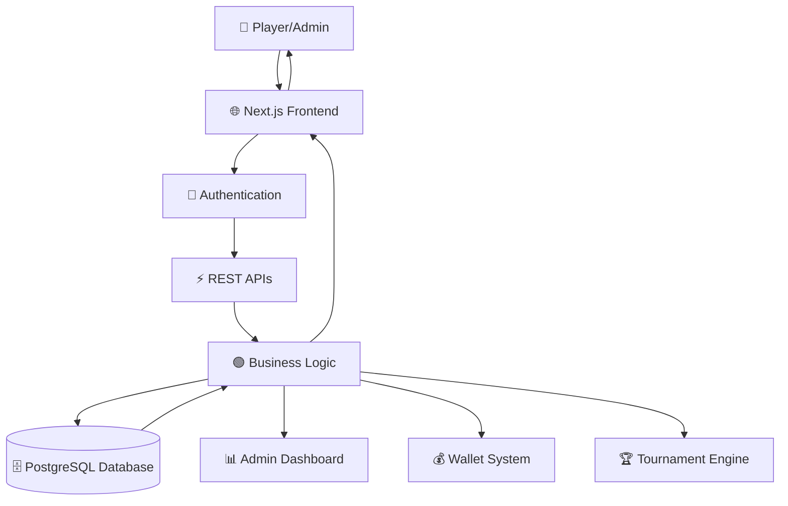

---

# 🔄 Application Workflow

```text
User Registration
        │
        ▼
Email / Login Authentication
        │
        ▼
User Dashboard
        │
        ├──────────────► Wallet
        │                     │
        │                     ▼
        │             Deposit / Withdraw
        │                     │
        │                     ▼
        │              Transaction History
        │
        ▼
Browse Tournaments
        │
        ▼
Join Tournament
        │
        ▼
Tournament Starts
        │
        ▼
Winner Selection
        │
        ▼
Reward Distribution
```

---

# 👥 User Roles

## 🎮 Player

Players can perform the following operations:

- Create Account
- Secure Login
- Manage Profile
- Browse Available Games
- Join Tournaments
- Deposit Coins
- Withdraw Coins
- View Wallet Balance
- View Transaction History
- Track Tournament Participation

---

## 👨‍💼 Admin

Administrators have platform management privileges.

Responsibilities include:

- Create Tournament
- Update Tournament
- Delete Tournament
- Manage Players
- Verify Deposits
- Approve Withdrawals
- Monitor Transactions
- Platform Analytics
- Manage Wallet Requests

---

## 👑 Master Admin

Highest privilege level.

Additional permissions:

- Manage Admin Accounts
- Global Platform Control
- Security Configuration
- Complete Database Access
- Platform Monitoring

---

# 🧩 Project Modules

The application is divided into multiple independent modules.

| Module | Description |
|----------|------------|
| Authentication | User Registration & Login |
| Tournament | Tournament Management |
| Wallet | Coin Deposit & Withdraw |
| Transactions | Payment History |
| Dashboard | User Dashboard |
| Admin Panel | Platform Administration |
| User Management | Manage Registered Users |
| Security | Authentication & Authorization |

---

# 🛠️ Technology Stack

## Frontend

| Technology | Purpose |
|------------|----------|
| Next.js | React Framework |
| React | UI Components |
| TypeScript | Type Safety |
| CSS | Styling |

---

## Backend

| Technology | Purpose |
|------------|----------|
| Next.js API Routes | Backend APIs |
| Node.js | Runtime Environment |

---

## Database

| Technology | Purpose |
|------------|----------|
| PostgreSQL | Relational Database |
| Supabase | Database + Authentication |

---

## Tools

| Tool | Usage |
|------|-------|
| Git | Version Control |
| GitHub | Repository Management |
| Vercel | Deployment |
| npm | Package Management |

---

# 📂 Project Structure

```
app/
│
├── api/                 → Backend API Routes
├── admin/               → Admin Dashboard
├── auth/                → Login & Registration
├── dashboard/           → User Dashboard
├── tournaments/         → Tournament Pages
├── wallet/              → Wallet Module
├── profile/             → User Profile
├── transactions/        → Transaction History
├── components/          → Reusable Components
├── hooks/               → Custom Hooks
├── utils/               → Utility Functions
├── styles/              → Styling Files
│
lib/
│
├── auth/                → Authentication Logic
├── database/            → Database Queries
├── store/               → Business Logic
├── helpers/             → Helper Functions
│
public/
│
├── images/
├── icons/
├── assets/
```

---

# 🗄 Database Design

The project uses **Supabase PostgreSQL** as the primary relational database.

Main entities include:

- Users
- Wallet
- Transactions
- Tournament
- Admin
- Deposits
- Withdrawals
- Rewards

The database is designed using relational architecture to maintain consistency between users, tournaments, wallets, and transaction records.

---

# 🔐 Authentication Flow

```text
Register
      │
      ▼
Create User
      │
      ▼
Store User Details
      │
      ▼
Login
      │
      ▼
Verify Credentials
      │
      ▼
Generate Session
      │
      ▼
Access Dashboard
```

---

# 💰 Wallet Flow

```text
User
 │
 ▼
Wallet Dashboard
 │
 ├────────► Deposit Coins
 │               │
 │               ▼
 │        Admin Verification
 │               │
 │               ▼
 │        Wallet Updated
 │
 ▼
Join Tournament
 │
 ▼
Entry Fee Deducted
 │
 ▼
Tournament Ends
 │
 ▼
Reward Credited
 │
 ▼
Transaction Recorded
```

---

# 📡 REST API Overview

The platform follows a REST-based architecture where the frontend communicates with backend API routes to perform authentication, tournament management, wallet operations, and transaction processing.

### Authentication APIs

| Method | Endpoint | Description |
|---------|----------|-------------|
| POST | `/api/auth/register` | Register a new user |
| POST | `/api/auth/login` | Authenticate user |
| POST | `/api/auth/logout` | Logout current user |

---

### Tournament APIs

| Method | Endpoint | Description |
|---------|----------|-------------|
| GET | `/api/tournaments` | Fetch all tournaments |
| GET | `/api/tournaments/:id` | Get tournament details |
| POST | `/api/tournaments/join` | Join a tournament |
| POST | `/api/tournaments/create` | Create tournament (Admin) |
| PUT | `/api/tournaments/update` | Update tournament |
| DELETE | `/api/tournaments/delete` | Delete tournament |

---

### Wallet APIs

| Method | Endpoint | Description |
|---------|----------|-------------|
| GET | `/api/wallet` | Fetch wallet balance |
| POST | `/api/wallet/deposit` | Deposit coins |
| POST | `/api/wallet/withdraw` | Withdraw coins |
| GET | `/api/transactions` | View transaction history |

---

# 🗄️ Database Overview

The platform uses **Supabase PostgreSQL** as its primary relational database.

### Main Tables

- Users
- Wallets
- Transactions
- Tournaments
- Tournament Participants
- Admins
- Rewards
- Deposits
- Withdrawals

---

## Entity Relationship

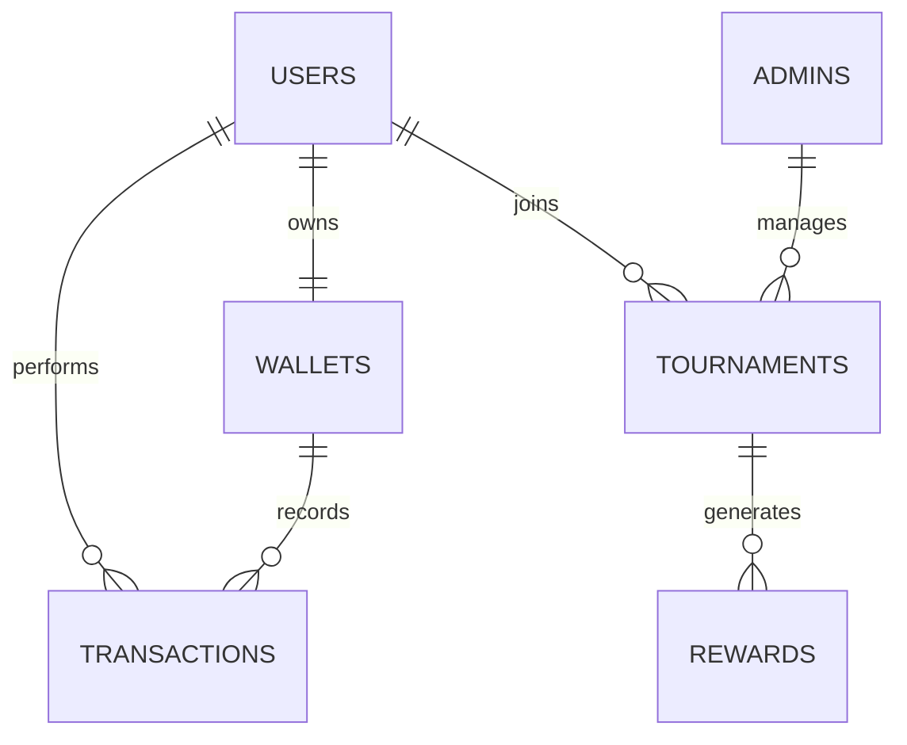

---

# 🔒 Security Features

Security was considered throughout the development of the application.

### Authentication

- Secure Login
- Protected Routes
- Session Validation
- User Authorization

### Authorization

- Role-Based Access Control (RBAC)
- Admin Protected Pages
- Master Admin Privileges
- Restricted API Access

### Database Security

- Parameterized SQL Queries
- Input Validation
- Secure Database Access
- Transaction Integrity

---

# ⚡ Performance Optimizations

Several optimizations have been implemented to improve scalability and user experience.

- Component Reusability
- Modular Code Structure
- Optimized Database Queries
- Efficient API Calls
- Lazy Loaded Components
- Optimized Asset Loading
- Responsive UI
- Code Splitting using Next.js

---

# 📱 Responsive Design

The platform is fully responsive and optimized for multiple screen sizes.

Supported devices:

- Desktop
- Laptop
- Tablet
- Mobile

---

# 🌍 Time Management

All timestamps are stored in **UTC** inside the database.

During rendering, timestamps are converted into the user's local timezone (IST) for better readability and consistency.

---

# 🚀 Deployment

The application is deployed on **Vercel** with Supabase as the backend service.

Deployment includes:

- Automatic Builds
- Production Environment
- HTTPS Support
- Continuous Deployment
- GitHub Integration

---

# 🧪 Testing

The application has been manually tested for major user workflows including:

- User Registration
- Login & Logout
- Wallet Operations
- Tournament Registration
- Admin Operations
- Transaction History
- Responsive Layout
- Route Protection

---

# 📸 Application Preview

The following screenshots provide a walkthrough of the major modules of the platform.

---

## 🏠 Home Page

The landing page introduces the platform and allows users to navigate through tournaments, games, authentication, FAQs, and other important sections.

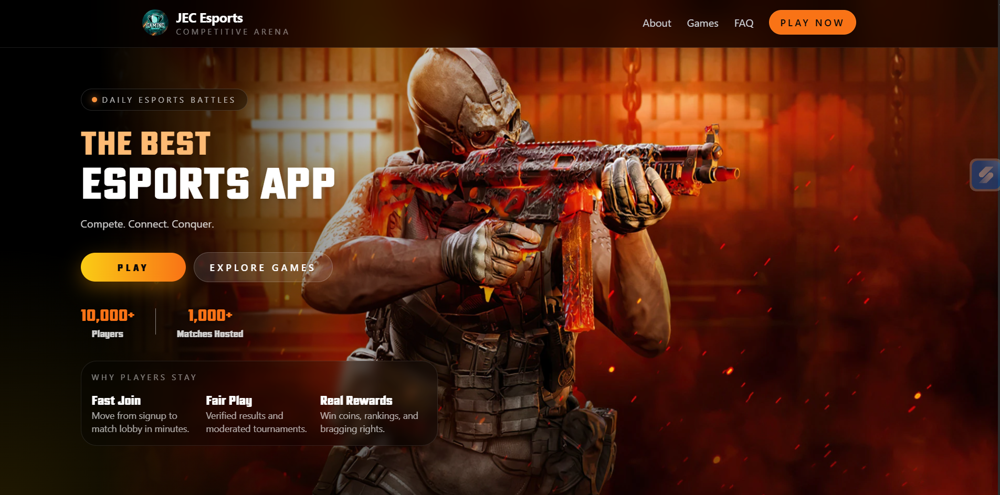

---

## 🎮 Games

Browse all available esports titles and explore tournaments associated with each game.

Features:
- Supported Games
- Game Details
- Tournament Availability

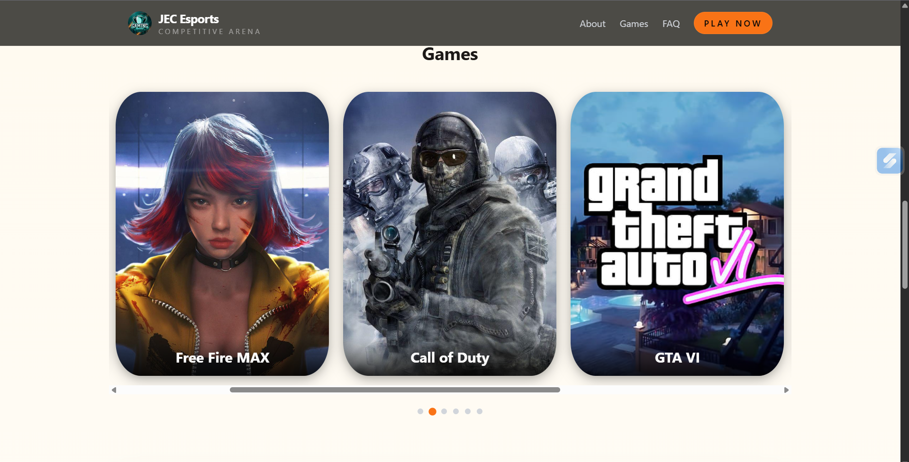

---

## 👤 User Dashboard

A personalized dashboard where users can manage their account and track platform activities.

Features:

- Wallet Balance
- Tournament History
- Profile Information
- Statistics
- Recent Activity

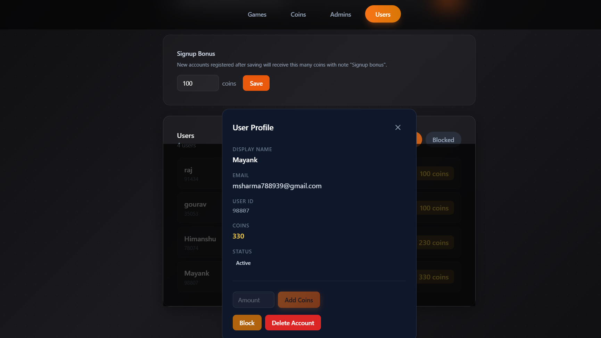

---

## 💰 Wallet & Transactions

The wallet module enables users to deposit coins, withdraw balance, and view complete transaction history.

Features:

- Wallet Balance
- Deposit Coins
- Withdraw Coins
- Transaction History
- Payment Tracking

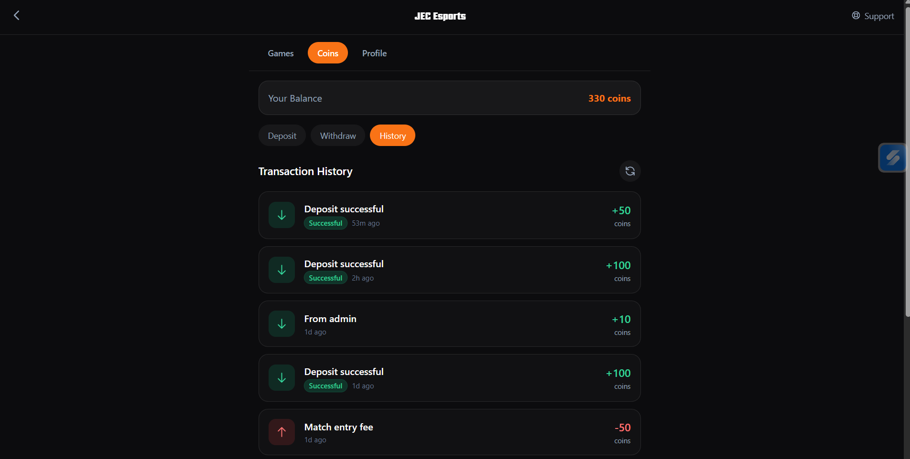

---

## 📝 User Authentication

### Login

Secure authentication system for registered users.

Features:

- Email Login
- Password Authentication
- Secure Session

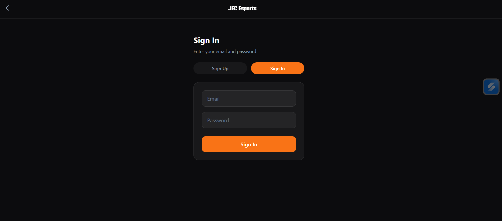

---

### Registration

Allows new users to create an account and join the platform.

Features:

- User Registration
- Account Creation
- Validation
- Authentication

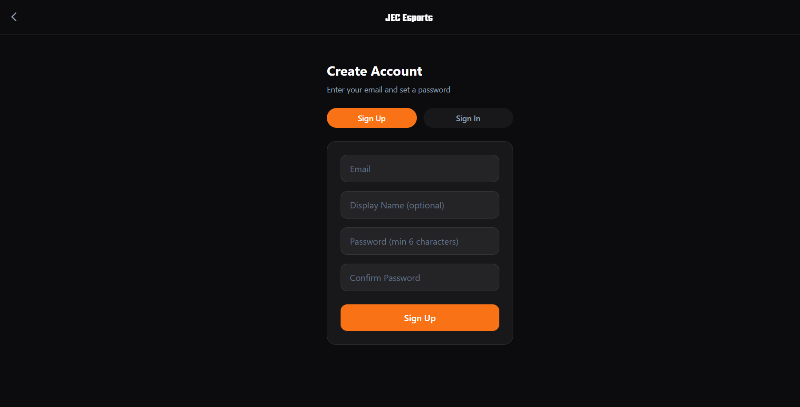

---

## 👨‍💻 About & FAQ

Provides platform information, frequently asked questions, developer details, and useful resources.

Features:

- About Platform
- FAQs
- Developer Information
- Social Links

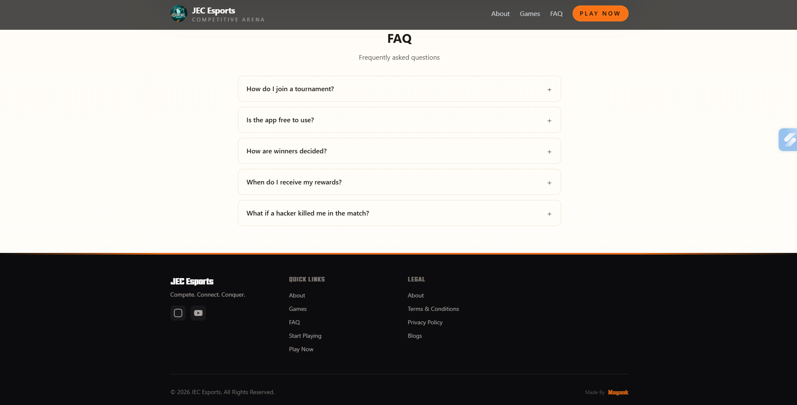

---

# 👨‍💼 Admin Panel

A dedicated administration dashboard for complete platform management.

The admin panel provides centralized control over tournaments, users, wallets, and transactions.

Major functionalities include:

- Tournament Management
- User Management
- Deposit Verification
- Withdrawal Approval
- Wallet Monitoring
- Analytics Dashboard
- Platform Administration

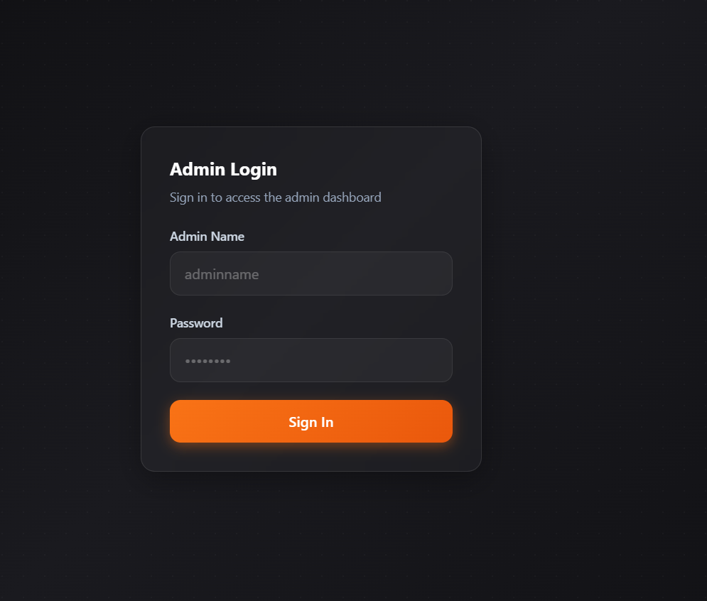

---

## 👥 Existing Users

Displays all registered users with their account information.

Admin can:

- Search Users
- View Profiles
- Monitor Activity
- Manage Accounts

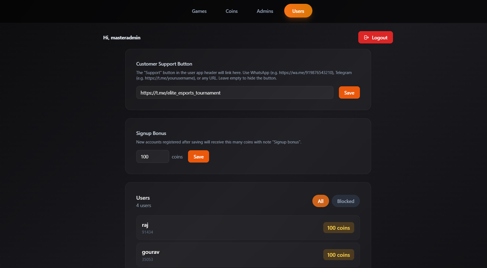

---

## 👤 User Details

Detailed profile page containing complete information about an individual user.

Includes:

- Personal Information
- Wallet Details
- Tournament Participation
- Transactions
- Activity Logs

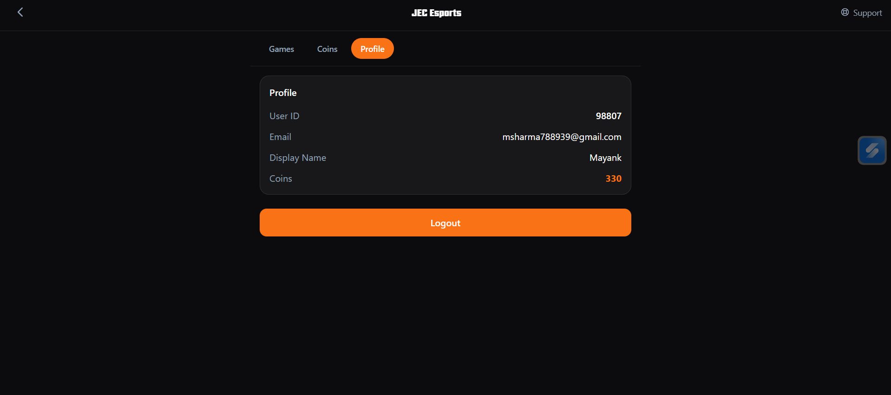

---

# 💼 Recruiter Highlights

This project demonstrates hands-on experience with:

- Full Stack Web Development
- Authentication & Authorization
- REST API Development
- PostgreSQL Database Design
- Supabase Integration
- Role-Based Access Control
- Modular Architecture
- Production Deployment
- Version Control using Git
- Scalable Application Design

---

# 🧠 Key Learnings

This project helped strengthen my understanding of:

- Next.js Application Architecture
- React Component Design
- TypeScript
- REST API Development
- Authentication Flow
- Database Relationships
- SQL Query Optimization
- Role-Based Access Control
- Git Workflow
- Production Deployment

---

# 🔮 Future Enhancements

The following features are planned for future releases:

- Live Match Tracking
- Real-Time Notifications
- Discord Integration
- Tournament Brackets
- Team Management
- AI-based Match Prediction
- Global Leaderboards
- Achievement System
- Push Notifications
- Mobile Application
- Payment Gateway Integration
- Dark Mode

---

# 🤝 Contribution

Contributions, feature suggestions, and improvements are always welcome.

If you would like to contribute:

1. Fork the repository
2. Create a new feature branch
3. Commit your changes
4. Push the branch
5. Create a Pull Request

---

# 👨‍💻 Developer

## Mayank Sharma

Information Technology Graduate

**Skills**

- Full Stack Development
- React.js
- Next.js
- TypeScript
- Node.js
- PostgreSQL
- Supabase
- REST APIs

---

# ⭐ Support

If you found this project useful,

⭐ Star the repository

🍴 Fork the project

💬 Share your feedback

---

# 📄 License

This project is intended for educational and portfolio purposes.
